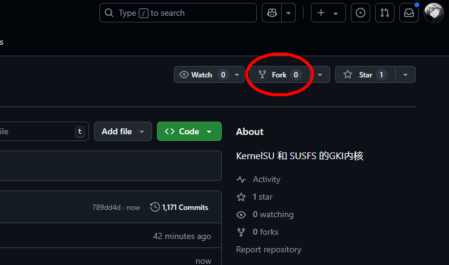
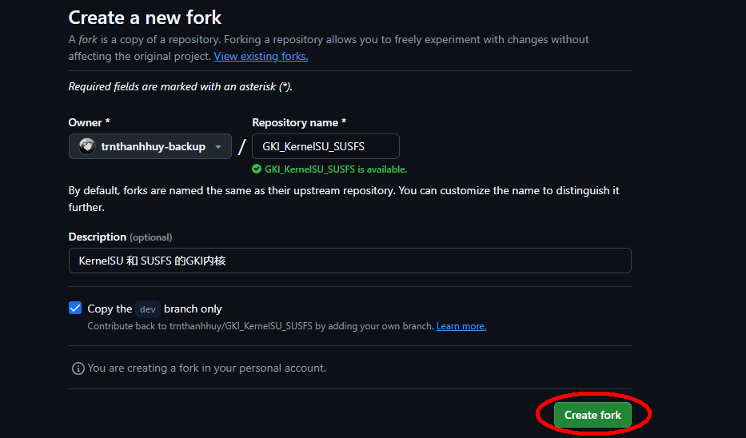
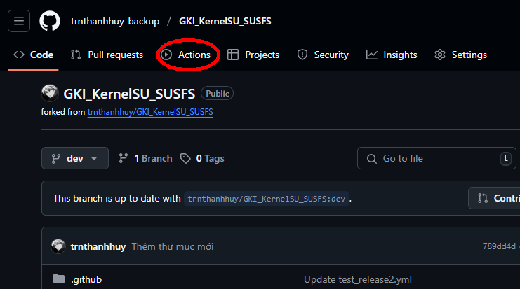
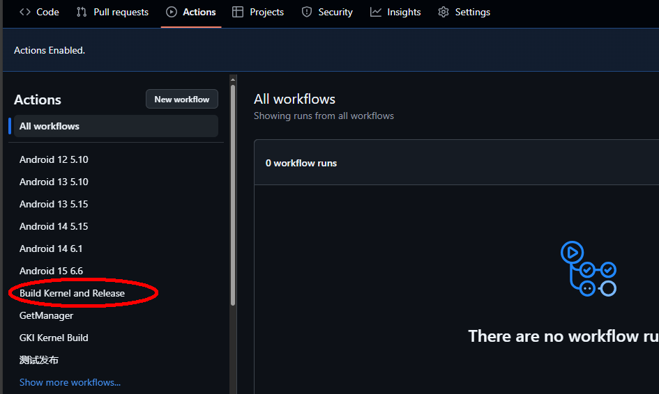
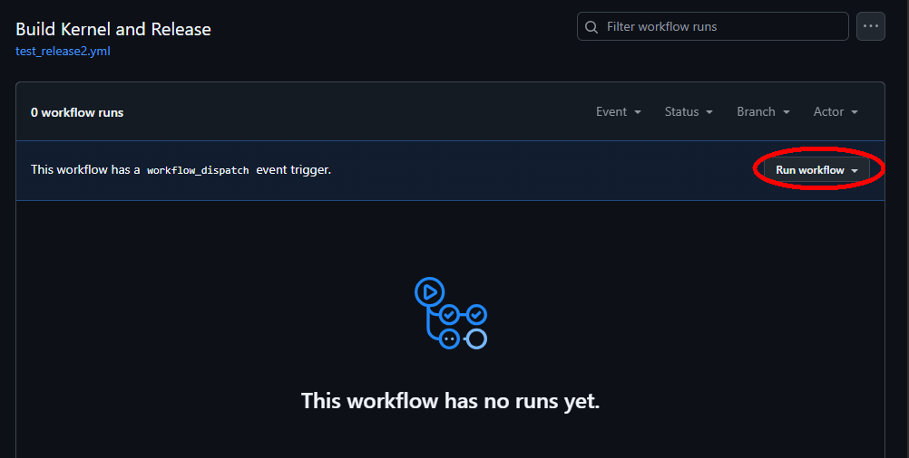
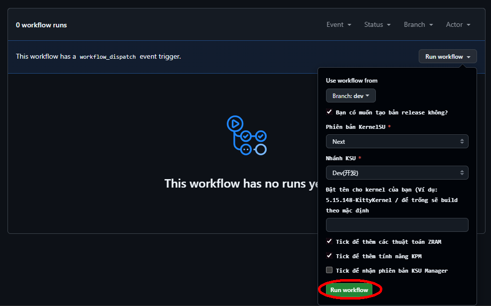
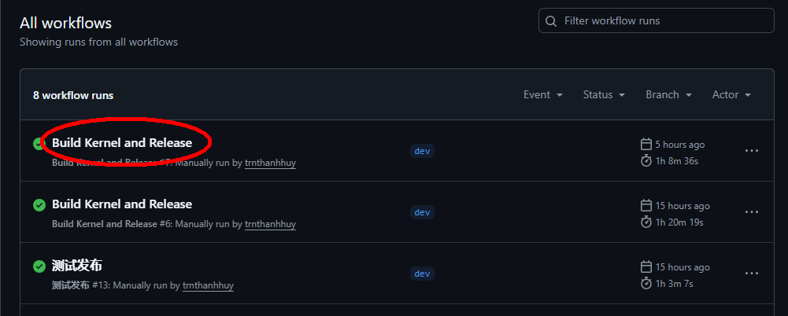
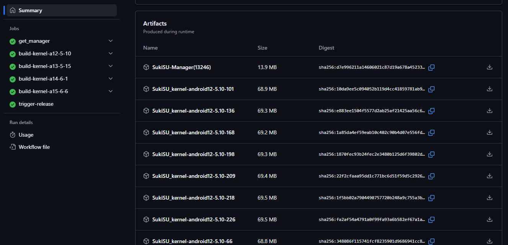

### Đây là một repo tự động giúp bạn build Kernel GKI + patch sẵn SUSFS!
> Vui lòng **đọc** kỹ nội dung trong file README.md này trước khi sử dụng lần đầu, đừng làm mất thời gian của người khác vì sự lười biếng của bạn!
>  - Vì SukiSU và KernelSU NEXT không còn duy trì các nhánh susfs cũ nữa nên cho dù bạn chọn Dev hay Stable khi build, các file cho ra sẽ là giống nhau.
> 
> Cập nhật mới:
> - Đã sửa lại lỗi không nhận KSU Manager của KernelSU Next, nếu vẫn còn lỗi này, xin hãy tải xuống gói KernelSU Next Manager này [KSU_Next_v1.0.9_12797](https://github.com/KernelSU-Next/KernelSU-Next/releases/download/v1.0.9/KernelSU_Next_v1.0.9_12797-release.apk)!
> - Thêm phần đặt tên cho kernel khi hiển thị trong Ksu Manager, ví dụ 5.15.148-KittyKernel, xin hãy fork về GitHub của bạn trước khi sử dụng tính năng này.

### Hỗ trợ
| Chức năng | Mô tả |
| --- | --- |
| [KernelSU](https://kernelsu.org/zh_CN/) | Bao gồm **Official, MKSU, SUKISU, NEXT** |
| [SUSFS4](https://gitlab.com/simonpunk/susfs4ksu) | Hỗ trợ các bản vá chức năng ẩn KSU ở cấp độ kernel |
| [BBR](https://blog.thinkin.top/archives/ke-pu-bbrdao-di-shi-shi-me) | Thuật toán kiểm soát TCP |
| [Wireguard](https://zh.wikipedia.org/wiki/WireGuard) | Tham khảo liên kết wiki bên trái |
| [LZ4KD](https://github.com/ShirkNeko/SukiSU_patch/tree/main/other) | Thuật toán ZRAM từ nguồn HUAWEI, bản vá được chuyển bởi [雲雲之枫](http://www.coolapk.com/u/24963680) |

### Hướng dẫn sử dụng
Có 2 cách để bạn có thể sử dụng repo này:
1. Fork repo này về Github của bạn và tự build

-  Đầu tiên hãy clone repo về GitHub của bạn
  

-  Tiếp theo thay thông tin và nhấn Create Fork
  

-  Sau đớ nhấn vào Action

-  Nhấn chọn Build Kernel and Release
  

-  Chọn Run Workflow
  

- Thay đổi thông tin theo nhu cầu của bạn, sau đó nhấn Run Workflow

- Sau khi build xong, nhấn lại vào workflow bạn đã chạy

- Tìm bản kernel phù hợp với thiết bị của bạn rồi tải nó xuống

2. Tải trục tiếp kernel đã build sẵn ở mục Release
Bạn có thể tải xuống tài nguyên [tại đây](https://github.com/trnthanhhuy/GKI_KernelSU_SUSFS/releases)
- Hãy tải phiên bản kernel đúng với máy của bạn, nếu không đũng phiên bản, thiết bị có thể bị lỗi, glitch hay nặng hơn có thể bị Bootloop

> ### Hướng dẫn chọn phiên bản kernel

> Tất nhiên rằng tôi rất khuyến khích bạn sử dụng phiên bản kernel cùng với kernel của thiết bị, nhưng nếu bạn không thể tìm thấy phiên bản của mình, bạn có thể thử cách dưới đây
> 1. Khi phiên bản chính GKI của điện thoại là 5.10.x (chẳng hạn như 5.10.168), bạn có thể flash kernel với phiên bản phụ cao hơn của cùng phiên bản chính (chẳng hạn như 5.10.198).
> 2. Về phiên bản **X-lts**, hãy lấy `android12-5.10.X-lts-AnyKernel3.zip` làm ví dụ:
> - **X-lts** biểu thị phiên bản hỗ trợ dài hạn (số phiên bản phụ là lớn nhất, ví dụ hiện tại là 5.10.238)
> - LTS Khi mã nguồn GKI được cập nhật, số phiên bản đã biên dịch sẽ tiếp tục tăng (các phiên bản khác như 198 đã được sửa vĩnh viễn)
> - Lưu ý: Mặc dù LTS là phiên bản mới nhất, **nhưng** phiên bản mới nhất ≠ ổn định nhất (chẳng hạn như 6.6.x có LỖI tự động khởi động lại)

### Hướng dãn cài đặt

- Hãy tải xuống phiên bản kernel đã được đề cập ở phần hướng dẫn sử dụng, sau đó hãy thực hiện việc chuẩn bị file backup boot, xem hướng dẫn [tại đây](https://magiskcn.com/payload-dumper-go-boot.html) hoặc tạo bản backup bằng custom recovery như OrangeFox hay TWRP trước khi thực hiện các bước tiếp theo.
    - Nếu sử dụng phiên bản Anykernel, chỉ cần flash như file zip bằng custom recovery như OrangeFox hay TWRP, việc còn lại hãy để Anykernel thực hiện. Sau khi flash xong hãy khởi động lại và kernel đã sẵn sàng để bạn sử dụng.
    - Nếu sử dụng file boot, kiểm tra xem thiết bị của bạn đang sử dụng loại boot là không nén, lz4 hay gz. Chi tiết xem [tại đây](https://kernelsu.org/guide/installation.html#install-by-kernelsu-boot-image). Cuối cùng hãy dùng lệnh 'fastboot flash boot "tên_file_boot.img"'. Tuyệt đối không sử dụng lệnh 'fastboot boot "tên_file_boot"', nó sẽ khiến thiết bị của bạn bị Bootloop. Sau khi flash xong, hãy khởi động lại và kernel đã sẵn sàng để bạn sử dụng.

- Xử lý khi bạn bị "Bootloop"
   -  Nếu bạn chuẩn bị file boot từ trước, bạn chỉ cần flash lại file boot đó bằng lệnh 'fastboot flash boot "tên_file_backupboot.img"' và nó sẽ hoạt động.
   -  Nếu bạn đã backup bằng OrangeFox hay TWRP, đơn giản chỉ cần flash lại bản backup đó và khởi động lại, và bạn sẽ thoát khỏi bootloop.
   -  Nếu bạn không chuẩn bị bất cứ thứ gì ở trên, rất tiếc, bạn có thể sẽ phải flash lại bản rom mà bạn đang dùng, dữ liệu của bạn sẽ bị mất khi bạn flash lại rom.

### Cảm ơn!
- @tiann - my goatt! <3 -  [KernelSU](https://github.com/tiann/KernelSU)
- @rifsxd - cảm ơn bạn về KernelSU Next - [KernelSU Next](https://github.com/KernelSU-Next/KernelSU-Next)
- @ShirkNeko - cảm ơn bạn về SukiSU Ultra - [SukiSU Ultra](https://github.com/SukiSU-Ultra/SukiSU-Ultra)
- @simonpunk - cảm ơn bạn về module SUSFS - [susfs4ksu](https://gitlab.com/simonpunk/susfs4ksu)
- @zzh20188 - cảm ơn bạn về Original Repository, xem tại đây: [GKI_KernelSU_SUSFS](https://github.com/zzh20188/GKI_KernelSU_SUSFS)
- @TheWildJames - cảm ơn bạn về AnyKernel3, xem tại đây: [GKI_KernelSU_SUSFS](https://github.com/WildKernels/GKI_KernelSU_SUSFS)
- và còn rất nhiều người đã commit, sửa chữa và phát triển nữa. Cảm ơn tất cả các bạn! <3

### Liên hệ với tôi!
Bạn có thể nêu ý kiến của mình...Tôi sẽ thử! \n
Bạn có thể tạo issue ngay tại trên repo này, hoặc nhắn tin đến Telegram của tôi [tại đây](https://t.me/trnthanhhuy) \n
Cảm ơn tất cả mọi người đã đọc hết trang README.md này!

